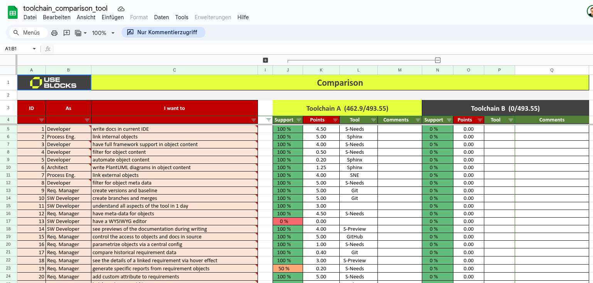
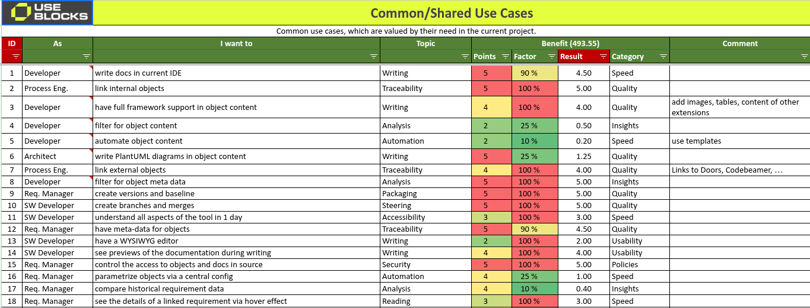
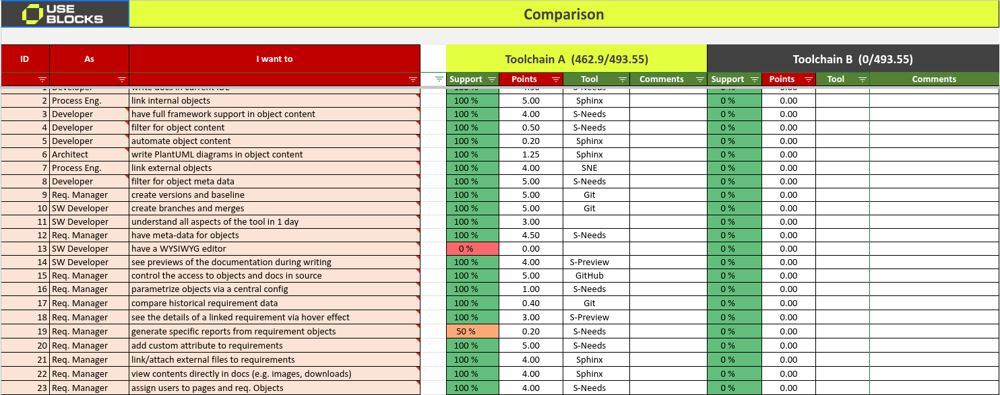
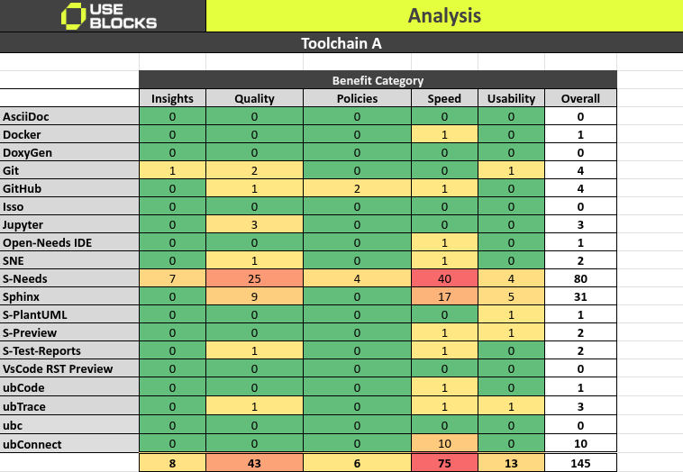

:author: Daniel Woste
:tags: update
:date: 2025-07-15

Toolchain comparison
====================

At some point, every project faces the challenge of selecting a tool
or, as systems become more complex, an entire toolchain. Choosing a
toolchain also means deciding against one or more alternatives.
Unfortunately, these decisions are often based on subjective criteria
rather than objective facts: personal experience, missing features,
anecdotal success stories from other teams, or simply a lack of access
to comprehensive information and user requirements.

This article presents a **toolchain comparison spreadsheet, free of
charge** and open for modification and internal use. It is prefilled
with tools from the docs-as-code ecosystem and, most importantly, **includes
over 160 user requirements** collected from automotive software
projects (150–1,500 users) over recent years.

Prefilled Docs-as-Code Data
---------------------------

The spreadsheet already contains process roles, tools, and other
criteria commonly used in Docs-as-Code projects, collected from
automotive projects at international OEM and Tier-1 companies.

Earlier versions of this spreadsheet have been used in multiple
projects to support decision-making during toolchain evaluations.

Requirements
~~~~~~~~~~~~

Over 160 requirements are already available, each with its associated
process role, a brief task description, and an initial weighting.

Some example requirements:

* As a **Req. Manager**, I want to **create versions and baselines**.
* As an **Architect**, I want to **write PlantUML diagrams in object
  content**.
* As a **SW Developer**, I want to **test the documentation links**.
* As a **Req. Manager**, I want to **have freely configurable object
  types**.
* As a **Process Eng.**, I want to **define the rules for requirement
  IDs**.
* As a **DevOps**, I want to **build HTML and export data to files
  during one build**.
* As a **Req. Manager**, I want to **integrate or copy IBM Doors issues
  as objects into my docs**.
* As a **Project Lead**, I want to **find triggers for performance
  problems (bottlenecks)**.

The full list of requirements can be found in the `sheet <https://docs.google.com/spreadsheets/d/13MwtKcdgjgT5v-j7CKwhIIQ9zKbR5_G-N56Uhz-0QaM/edit?gid=955912988#gid=955912988>`__.

Configuration
~~~~~~~~~~~~~

Prefilled process roles include:

* DevOps
* Manager
* Process Eng.
* Project Lead
* Quality Eng.
* Req. Manager
* SW Architect
* SW Developer
* SW Tester
* System Eng.

Available (but extendable) tools are:

* AsciiDoc - https://asciidoc.org/
* Docker - https://docs.docker.com/
* Doxygen - https://www.doxygen.nl/manual/
* Git - https://git-scm.com/doc
* GitHub - https://docs.github.com/
* Isso - https://posativ.org/isso/docs/
* Jupyter - https://docs.jupyter.org/
* Open-Needs IDE
* SNE
* Sphinx - https://www.sphinx-doc.org/
* Sphinx-Needs - https://sphinx-needs.readthedocs.io/
* Sphinx-PlantUML - https://sphinxcontrib-plantuml.readthedocs.io/
* Sphinx-Preview
* Sphinx-Test-Reports - https://sphinx-test-reports.readthedocs.io/
* VS Code RST Preview - https://marketplace.visualstudio.com/items?itemName=lextudio.restructuredtext
* ubCode - https://useblocks.com/products/ubcode/
* ubTrace - https://useblocks.com/products/ubtrace
* ubc - https://useblocks.com/
* ubConnect - https://useblocks.com/

The list of all requirments can be seen in the `sheet <https://docs.google.com/spreadsheets/d/13MwtKcdgjgT5v-j7CKwhIIQ9zKbR5_G-N56Uhz-0QaM/edit?gid=955912988#gid=955912988>`__.

Configuration
~~~~~~~~~~~~~

Prefilled process roles are:

* DevOps
* Manager
* Process Eng.
* Project Lead
* Quality Eng.
* Req. Manager
* SW Architect
* SW Developer
* SW Tester
* System Eng.

And available, but extendable, tools are:

* AsciiDoc - https://asciidoc.org/
* Docker - https://docs.docker.com/
* DoxyGen - https://www.doxygen.nl/manual/
* Git - https://git-scm.com/doc
* GitHub - https://docs.github.com/
* Isso - https://posativ.org/isso/docs/
* Jupyter - https://docs.jupyter.org/
* Open-Needs IDE
* SNE
* Sphinx - https://www.sphinx-doc.org/
* Sphinx-Needs - https://sphinx-needs.readthedocs.io/
* Sphinx-PlantUML - https://sphinxcontrib-plantuml.readthedocs.io/
* Sphinx-Preview
* Sphinx-Test-Reports - https://sphinx-test-reports.readthedocs.io/
* VsCode RST Preview - https://marketplace.visualstudio.com/items?itemName=lextudio.restructuredtext
* ubCode - https://useblocks.com/products/ubcode/
* ubTrace - https://useblocks.com/products/ubtrace
* ubc - https://useblocks.com/
* ubConnect - https://useblocks.com/

How to use the sheet
--------------------

The process of filling out the Toolchain Comparison spreadsheet is
divided into two parts, which are often handled by different people
depending on their expertise and project involvement.

The **Requirements** sheet gathers all requirements and should be
completed collaboratively. For example, a System Architect will have
different needs than a Software Developer, and Safety Engineers or
Project Leads will have their own priorities.

The subsequent **Comparison** sheet should be filled out by the
responsible toolchain owners, who have already evaluated or tested the
tools. It is important that the fulfillment of a requirement is based
on the current capabilities of the toolchain, not on promised future
features. If a feature is missing in Toolchain A and is planned for
the future, remember that Toolchain B's developers can also use that
time to close their own gaps. Relying on future promises leads to
ambiguous results and does not help solve present problems.

Requirements sheet
~~~~~~~~~~~~~~~~~~

In this `sheet <https://docs.google.com/spreadsheets/d/13MwtKcdgjgT5v-j7CKwhIIQ9zKbR5_G-N56Uhz-0QaM/edit?gid=955912988#gid=955912988>`__,
requirements are collected and weighted.

Requirements are written like user stories, with **process role** and **process
task** specified in separate columns. Example: As a **Process
Engineer**, I want to **link internal objects**.

Each requirement can be assigned a topic to help with sorting and
filtering.

Next, the project benefit needs to be defined. For this, **Points**
from 1–5 can be given, where **1** means **nice-to-have** and **5** is
a **must-have** or even a **show stopper**.

This is followed by a **Factor**: **5–100%**. The factor allows you to
indicate the real benefit of a feature. For example, a feature saving
60 minutes per week for 2 project managers may be less important than
a feature saving 10 minutes for 200 developers. 120 minutes vs. 2,000
minutes in total project time saved.

**Points** and **Factor** are highly project-specific and should be
reviewed by the process team to avoid biased weights, as people tend
to rate their own tasks higher than those of other project roles.

At the end, a final **Result** for the requirement is calculated:
Simply **Points** multiplied by the **Factor**. This represents the
real value of the requirement for the specific project.

Finally, a benefit category can be set to indicate why this
requirement is important—for example, to speed up development or to
improve the final product quality.

.. hint::

   **Do not start from scratch!**

   Most projects share almost the same set of requirements. They may
   differ by about 10%, and the weighting is usually project-specific.

   The more than 160 requirements already included will help you get
   started quickly and enable you to build a solid decision matrix in
   less time.

Comparison sheet
~~~~~~~~~~~~~~~~

The reuqirements are automatically moved over to the `Comparsion sheet <https://docs.google.com/spreadsheets/d/13MwtKcdgjgT5v-j7CKwhIIQ9zKbR5_G-N56Uhz-0QaM/edit?gid=1557903405#gid=1557903405>`__
and are not allowed to be changed.

For both Toolchains, an entry shall be given in the **Support** column
if a requirement is fullfilled by **100%, 50% or 0%**.

**100%** means the requirment is fully fullfilled. **0%** is for
unfullfilled requirements. And **50%** is for rare cases, where
workarounds may be available, which allow to reach the goal of the
requirment maybe with some extra work.

The **Points** column contains the finally reached points for a
requirement: **Points** from the **Requirement** sheet multiplied with
the **Support** value.

You can further specify the information by assigning the related tool
for each requirement.

The final result—the total points achieved—can be seen in row 3, where
the points reached are compared to the overall possible points.

Analysis sheet
~~~~~~~~~~~~~~

The `Analysis sheet <https://docs.google.com/spreadsheets/d/13MwtKcdgjgT5v-j7CKwhIIQ9zKbR5_G-N56Uhz-0QaM/edit?gid=1318461535#gid=1318461535>`__
provides insights into the main benefits each tool offers.

Does a tool help you speed up development, or is it more valuable for
providing data insights?

This view helps you assess how important a specific tool is for your
process and the expected improvements it brings to the toolchain.

Other sheets
~~~~~~~~~~~~

Additional sheets included:

* **Overview**: The welcome page of the spreadsheet.
* **Help**: Instructions and tips for using the spreadsheet.
* **Config**: Configuration options for drop-downs and related settings.
* **License**: The license information for the spreadsheet.

Motivation
----------

The motivation for creating and sharing this sheet is that most tool
decisions are made behind closed doors, often by a small group of
people who do not fully represent the real project situation.
Frequently, these decisions are driven by a single tool vendor or team
with preferred access, who may define and even hide requirements to
gain an advantage.

While this toolchain comparison cannot eliminate discussions based on
politics or budget, it does provide a transparent way to evaluate
supported features against a comprehensive list of project-specific
requirements.

In the end, such a list also helps to revisit and justify past
decisions in the future.

Contribution
------------

The list of requirements and tools can never be fully complete. I
welcome any additional requirements or suggestions that could help
extend the current list.

You can contribute by sharing your own filled toolchain comparison
spreadsheet—either publicly or by sending it to me via email.

Smaller feedback can also be provided by writing comments directly in
the spreadsheet, but please note that these comments are visible to
everyone.
